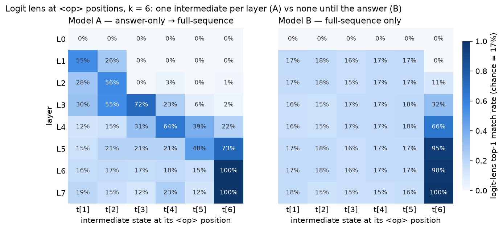

# Training a transformer to compose one step per layer (and proving it)

Supporting code and checkpoints for
[**Training a Transformer to Compose One Step Per Layer (and Proving It)**](https://www.lesswrong.com/posts/QEbC3t4XpLsiwhRqg/training-a-transformer-to-compose-one-step-per-layer-and)
([mirror](https://www.brendanlong.com/training-a-transformer-to-compose-one-step-per-layer-and-proving-it.html)).

Getting a small transformer to *actually* learn a sequential algorithm —
rather than a parallel shortcut or a memorized lookup table — took a specific
combination of choices, and then some mechanistic work to prove it happened:

1. **Task:** compose k ≤ 6 elements of the non-commutative group S3 ≅ D3
   (from [Zhang et al.'s LEGO](https://arxiv.org/abs/2206.04301)), as
   `<start> e0 <op> g1 <op> g2 … <predict> answer`. A commutative version
   collapses to counting minus signs in one layer.
2. **Loss curriculum:** train with loss on the answer token only until 100%,
   *then* switch to full-sequence (next-token) loss. Full-sequence loss from
   scratch (3/3 seeds) produced 100%-accurate models with no intermediate
   state visible to the lens and no dependence on any particular layer —
   behaviourally a lookup table; a sequential algorithm learned under
   answer-only loss survives the switch.
3. **Data weighting by difficulty:** sample chain length k with weight k²
   (1:4:9:16:25:36). This produced the first clean one-step-per-layer
   staircase in a *standard* (non-weight-shared) transformer.
4. **Weight sharing** (a universal transformer) learns the sequential
   algorithm much more easily under answer-only loss, even without weighting.
5. **Proof:** the logit lens shows each intermediate state appearing at its
   `<op>` position one layer at a time (Model A), versus nothing above chance
   until the answer coalesces at layer 3 (Model B); and zeroing each `<op>`
   position *after* its critical layer leaves accuracy at ~100% while zeroing
   *at* the critical layer destroys it — for Model A only.

| Model | Layers | Dim | Heads | Loss | Data weight | Checkpoint |
|---|---|---|---|---|---|---|
| A | 8 | 96 | 6 | answer-only → full-sequence | k² | `lego/std_96d_6h_8L_kp2_s42_curriculum_FSL/step_97656.pt` |
| B | 8 | 96 | 6 | full-sequence | k² | `lego/std_96d_6h_8L_kp2_s42_fsl_only/step_156250.pt` |



**Links:** [RESULTS.md](RESULTS.md) (the full experiment log, one entry per
run with exact commands and wandb IDs; the writeup's models are
[Phase 16](results/13-k-weighted-curriculum.md)) ·
[EXPERIMENT_PLAN.md](EXPERIMENT_PLAN.md) (the original research question,
which is broader than the writeup) ·
[public wandb project](https://wandb.ai/brendanlong-com/lego-reasoning) ·
[HF dataset with the checkpoints](https://huggingface.co/datasets/brendanlong/sequential-transformer-lens-experiment).

## Repo layout

```
lego/
  generator.py            # finite groups (S3 by default) and composition chains
  tokenizer.py            # <start> e <op> g … <predict> answer  (vocab = 10 for S3)
  data.py                 # streaming dataset with k^power weighting; answer-only / full-sequence loss
  model.py                # standard + weight-shared decoder-only transformers with residual hooks
  training.py             # training loop, evaluation, checkpoint load (local or hf:)
  train.py                # single-phase training        uv run python -m lego.train --help
  curriculum_ao_to_fsl.py # answer-only -> full-sequence curriculum (Model A's recipe)
  analyze_logit_lens.py   # the staircase tables (+ heatmap figure)
  ablate_critical_layer.py# zero <op> positions from / after their critical layer (the writeup's ablation)
  ablate_sequential.py    # progressive / reverse / random clause zeroing (RESULTS.md)
                          # (train.py takes --group S3|S4|A5|S5; the curriculum and analysis scripts are S3-only)
  tests/                  # fast CPU tests + a smoke training run
common/                   # checkpoint I/O + HF artifact download, optimizer, schedule, streaming, wandb
results/                  # per-phase experiment logs linked from RESULTS.md
scripts/                  # reproduction entry points (below)
skypilot/reproduce.yaml   # cloud-GPU reproduction via SkyPilot
figures/                  # figures used in this README
```

## Setup

Requires Python ≥ 3.12 and [uv](https://docs.astral.sh/uv/):

```bash
uv sync
uv run pytest             # 127 CPU tests incl. a smoke training run, ~6 s
```

A GPU is optional for the analyses (models are tiny, checkpoints download on
demand) and strongly recommended for training (any ~8 GB card is plenty).

## Reproduce the analyses (no GPU, no accounts, ~30 seconds)

```bash
./scripts/reproduce_analyses.sh
```

This downloads three checkpoints (Model A before and after phase 2, Model B;
~3.6 MB each) and prints:

- the logit-lens staircase tables (`lego.analyze_logit_lens`). The writeup's
  tables are captioned "softmax probability" but their numbers are the
  `top-1 match rate` at `<op>` positions, which is what reproduces them; the
  script also prints the actual softmax mass, which tracks top-1 within ~10
  points;
- the critical-layer ablation tables (`lego.ablate_critical_layer`) — for
  Model A the critical layers are read off the lens (L1–L5 for t[1]–t[5]);
  for Model B, which has no staircase, Model A's layers are applied with
  `--critical-layers 1 2 3 4 5`. A third row, "zero from L0", zeroes each
  position at every layer: Model A drops to chance (19.9% with all five
  zeroed) while Model B stays at 98.0% — it never reads the `<op>` positions,
  so its 100%s in the other rows mean "nothing to ablate", not
  "ablation-robust". (The writeup's footnote quotes 15% for both models; that
  run also zeroed the `<predict>` readout, which takes any model to chance.)
- a layer sweep (`lego.ablate_critical_layer --sweep`): accuracy with each
  element and `<op>` position zeroed from every layer onward. Model A
  consumes one operand per layer (the "all element positions" row climbs
  gradually to L6); Model B consumes them all at once, early (a single cliff
  between L3 and L4) — so the non-sequential model also has a critical
  layer, just one shared by every input;
- the progressive/reverse/random clause-zeroing test from RESULTS.md
  (`lego.ablate_sequential`).

Every number in the writeup's four tables (and, with `<predict>` included,
its 15% footnote) reproduces exactly from these checkpoints (n = 500 examples and `--seed 999` for the lens
tables, n = 1000 and `--seed 999` for the critical-layer ablation). Any script
also takes a local `--checkpoint path.pt`.

## Reproduce the training (~a GPU-evening)

```bash
./scripts/reproduce_training.sh   # Model A and Model B; extra seeds/arms commented out
```

Or a single run:

```bash
# Model A: answer-only -> full-sequence curriculum, k^2 weighting
uv run python -m lego.curriculum_ao_to_fsl --dim 96 --n-heads 6 --n-layers 8 \
    --ao-examples 30000000 --fsl-examples 50000000 --k-power 2 --seed 42 --no-compile
# Model B: full-sequence loss from scratch
uv run python -m lego.train --dim 96 --n-heads 6 --n-layers 8 --loss-mode full-sequence \
    --generate-n 80000000 --k-power 2 --seed 42 --no-compile
```

Model A is 58,593 answer-only steps + 97,656 full-sequence steps and Model B
is 156,250 full-sequence steps at batch 512. Wall-clock was not recorded for
these two runs; comparable 8-layer runs in RESULTS.md did ~16 steps/s on an
RTX 3060 Ti, so expect a few hours each (Model A was trained on a 3060 Ti,
Model B on an RTX 4090). The script logs to wandb only if `WANDB_API_KEY` is
set; the bare commands above log by default — pass `--no-wandb` to skip.
**The outcome is seed-dependent** — that is much of the point of the writeup —
so a rerun may not show a staircase at all: seed 43 reached 100% accuracy but
lost the lens-visible staircase for t[1]–t[3] (its checkpoints are on the HF
dataset too).

### On a cloud GPU (SkyPilot)

```bash
sky launch skypilot/reproduce.yaml --infra <your-cloud> --down -y
# or a single run:
sky launch skypilot/reproduce.yaml --infra <your-cloud> --down -y \
  --env RUN_CMD="uv run python -m lego.train --dim 96 --n-heads 6 --n-layers 8 --loss-mode full-sequence --generate-n 80000000 --k-power 2 --seed 42 --no-compile --no-wandb"
```

Pass `--secret WANDB_API_KEY` to log to your own wandb.

## Provenance

This repo is extracted from a private research monorepo whose `lego`
experiment asked a broader question (whether weight-shared transformers are
more interpretable than standard ones); the writeup is the "how to train a
sequential model at all" part of that story. `RESULTS.md` is the monorepo's
experiment log verbatim, with a header note mapping its commands and private
checkpoint URIs onto this repo. Only the code the writeup needs is included
(the note lists what isn't); the public checkpoints are copies of the runs
the writeup uses (identified through the wandb artifact log and confirmed
against the tables in `results/13-k-weighted-curriculum.md`), plus the seed
replicates and weight-shared arms it mentions.

`lego/ablate_critical_layer.py` was written for this release; the original
per-layer ablation script was never committed. It uses the model's existing
`forward_with_layer_hooks` API and its output matches the writeup's table and
footnote exactly, which is the only sense in which it is "the same" analysis.

**All of the code in this repository was written and run by Claude
(Anthropic's Claude Code), based on
[Brendan Long](https://www.brendanlong.com/pages/about-me.html)'s prompts and
direction, with most intermediate results reviewed by Claude subagents;
Brendan reviewed the results and wrote the writeup.**

## License

[MIT](LICENSE)
