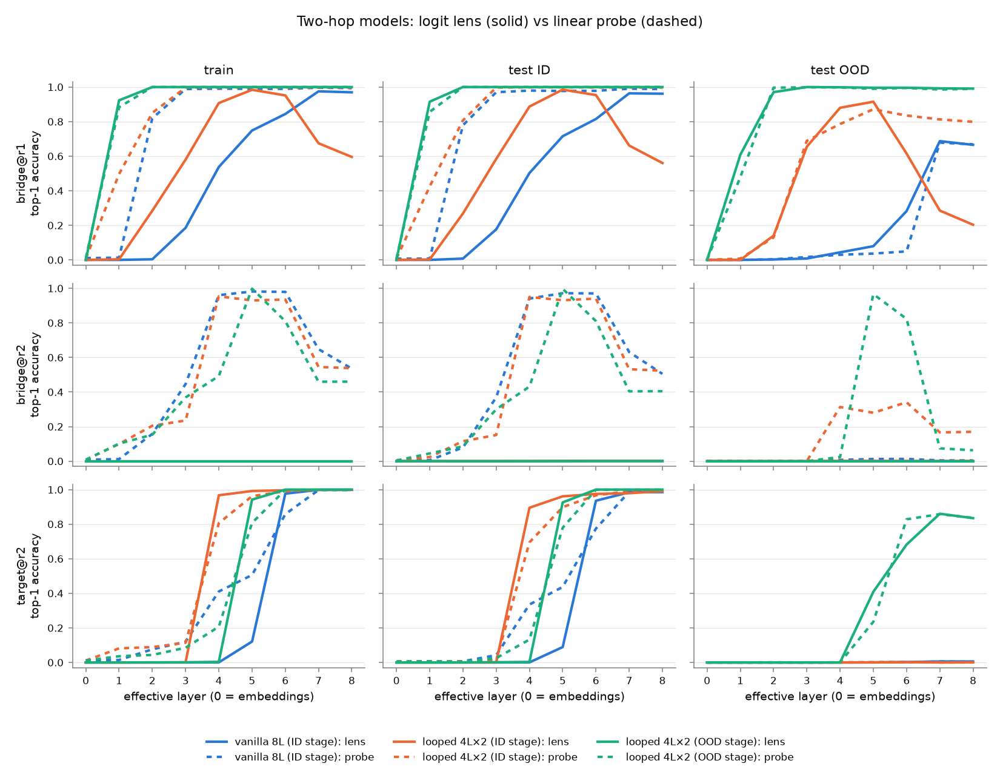
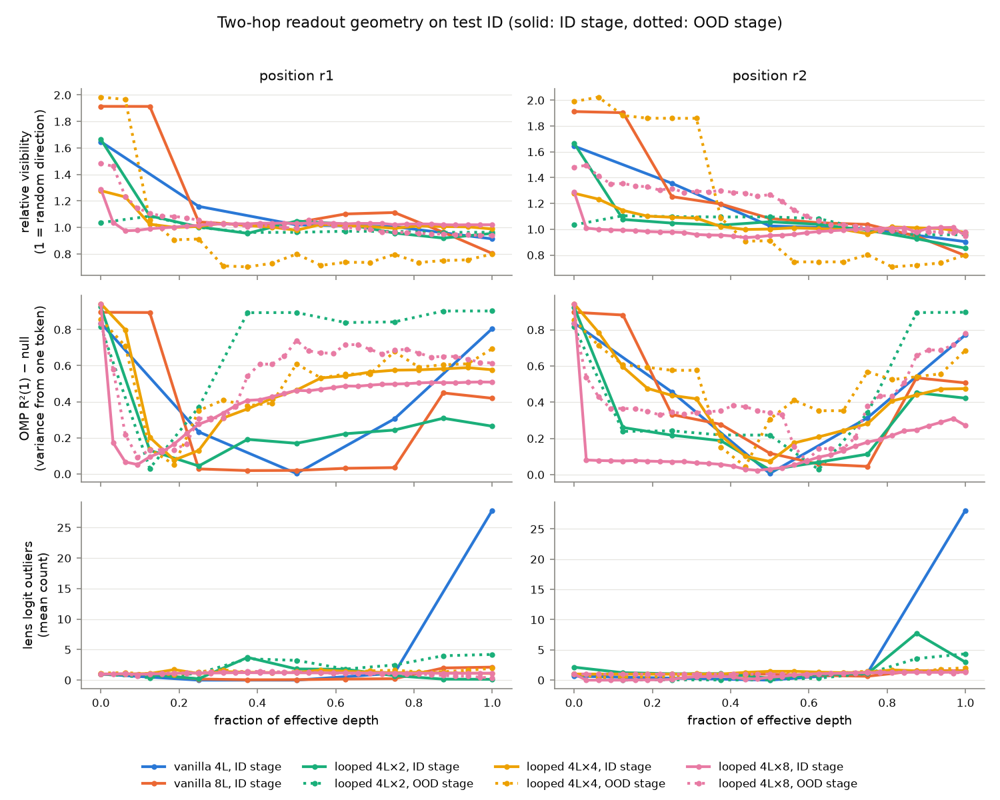
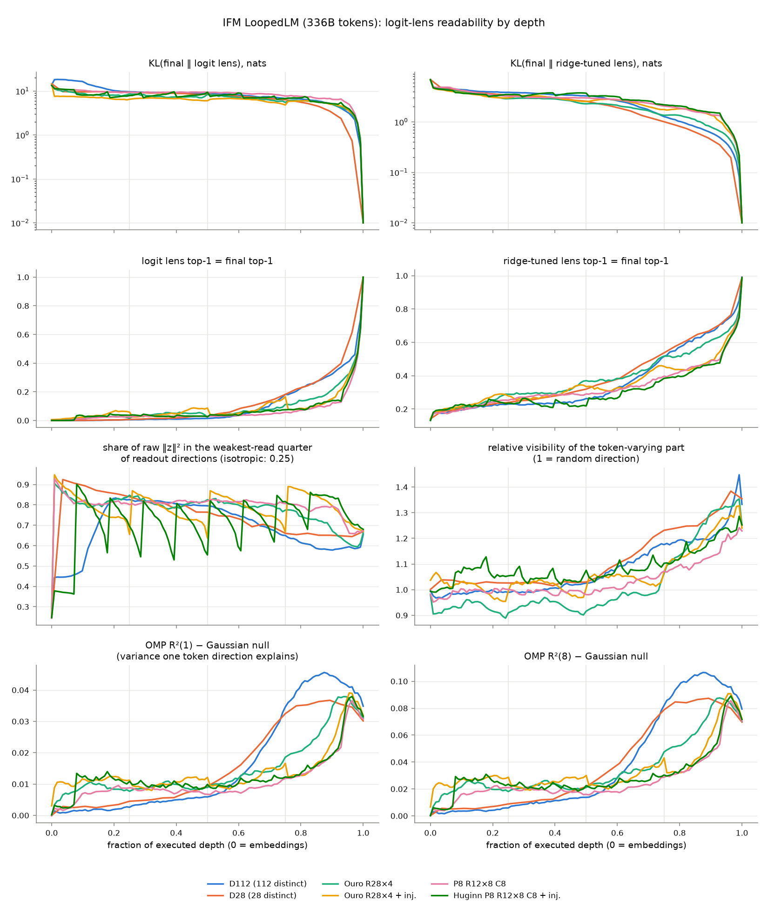

# Are looped transformers more logit-lens-readable? Two public model pairs

Added after the writeup. Our own S3 comparison was abandoned because the looped
and standard models learned different algorithms, so any lens difference could
not be put down to weight sharing. Here the same measurements run on two
public families where someone else trained looped and standard models on the
same data:

- **Two-hop composition** (Kohli et al. 2026, [Loop, Think &
  Generalize](https://arxiv.org/abs/2604.07822)). GPT-2 blocks, width 768,
  answer-only loss, a 2,000-entity knowledge graph. The input is `<h><r1><r2>`,
  the answer is `t = r2(r1(h))`, and the *bridge* `b = r1(h)` is an entity
  token the model is trained to output for the one-hop question `<h><r1>`, but
  never as part of a two-hop question. `r<R>_l<L>` is an L-layer stack run R
  times; `r2_l4` and the vanilla `r1_l8` have the same depth and FLOPs. On
  held-out compositions of *seen* facts ("test ID") both solve the task through
  the bridge; only looped models eventually generalise to compositions of facts
  never composed in training ("test OOD"). The released checkpoints mark three
  training stages: train fit, ID generalisation, OOD generalisation (one run
  per configuration).
- **IFM LoopedLM Part I** ([blog](https://huskydoge.github.io/husky-blog/posts/recursive_models/towards-looped-models-done-right/),
  [checkpoints](https://huggingface.co/collections/IFM/towards-looped-models-done-right-6ab9f671bb1c97e33b27d14c)).
  Language models trained on the same 336B TxT360 tokens with the same
  tokenizer (250k vocabulary), width 1536, seed and schedule, loss on the final
  output only. Every loop recipe stores 28 blocks (1.5B parameters) and
  executes 112: Ouro-style (all 28 blocks × 4), and prelude–loop–coda
  (8 + 12 × 8 + 8), each with and without re-injecting the input. Controls:
  D112 (112 distinct blocks, 3.7B, depth-matched) and D28 (28 blocks,
  parameter-matched). Neither IFM paper does any lens or probe analysis.

Code: `looped_lm/` (`twohop.py`, `ifm.py`, shared metrics in
`lens_metrics.py`, figures and tables in `report.py`, pipeline in
`looped_lm/Snakefile`). Raw results: `results/looped-lm/`. Every table below is
printed by `uv run python -m looped_lm.report results/looped-lm`.

## Summary

Report page: https://looped-lens-a783c534.surge.sh (built by
`looped_lm/build_html_report.py`).

The question is whether looping makes the **logit lens** show the intermediate
state the model actually uses. A causal test checks whether what the lens
shows is what the model reads; a probe checks what the lens misses.

- **Two-hop task: yes, once the model loops enough or trains long enough.** In
  the 4- and 8-iteration models, and in the 2-iteration model at its OOD stage,
  the lens shows the bridge at 100% during the layers where the second hop
  reads it from the first relation's position, and swapping only the
  lens-visible component onto another entity redirects 56–100% of answers;
  removing it drops accuracy to 1–73%.
- **Standard models: no.** The second hop reads the bridge at L2–L3 (8 layers)
  or L1 (4 layers), when the lens shows it 17% / 0% of the time, and swapping
  the lens-visible component redirects 0%. The lens reads the bridge only later
  (from L7 in the 8-layer model), after it has been used; at that position the
  model is also answering the trained one-hop fact `<h><r1>`, which is what the
  lens shows.
- **Looping alone isn't enough:** the 2-iteration model at its ID stage
  behaves like the standard ones (1%).
- **Language models (IFM): no advantage.** From 75% of depth on, both standard
  models are more lens-readable than every loop design. There is no known
  intermediate there, so no causal test. More training doesn't change this: at
  the end-of-schedule 500B-token checkpoints (D112 and Huginn only) the
  standard model's lead at 90% depth is the same (logit lens +20 → +21 points,
  tuned lens +20 → +20), with both models about a point better at prediction.
  The 336B Huginn run, repeated on a different GPU, reproduces within 0.5
  points (`results/looped-lm/ifm-check/`).
- Caveats: one run per configuration, stage- (not step-) matched two-hop
  checkpoints, one task — and the most favourable one for the lens, since the
  intermediate is also a trained output token.

## Measurements

At every effective layer (every block *execution* for looped models):

- **Logit lens**: final norm + unembedding applied to the residual. For
  two-hop, top-1 accuracy for the bridge at the `r1` position (their Figure 4),
  the bridge at the `r2` position, and the answer at `r2`. For the LMs, KL from
  the final distribution and top-1 agreement with the final prediction.
- **Probes**, the reference for "linearly present". Two-hop: a 2,000-way
  linear probe on the normed residual, trained on 20,000 training compositions
  that share no (h, r1) with any evaluation example (the residual at `r1`
  depends only on that pair, so otherwise the probe would have seen 40% of the
  test inputs). A probe through the frozen unembedding (an affine map into the
  readout) agrees with it within 0.4 points at the median, but its optimisation
  sometimes fails (up to 38 points lower on train-stage checkpoints), so only
  the linear probe is quoted. LMs: a ridge-regression map (with intercept) from
  each layer's normed residual to the final one, read out through the model's
  head — a closed-form tuned lens; at the final layer it agrees with the model
  on 99–100% of tokens.
- **Dark subspace**: the share of the normed residual's energy in the quarter
  of directions the readout (unembedding with the norm gain folded in) reads
  most weakly. 25% for an isotropic vector. *Relative visibility* is
  ‖W z‖² / ‖z‖² over its value for a random direction.
- **How many tokens**: orthogonal matching pursuit of the batch-centered
  normed residual over the unit-norm unembedding rows, as R²(k) for k = 1…8,
  against a Gaussian null with the same covariance; plus which token OMP picks
  first.

## Two-hop causal test

`looped_lm/twohop_causal.py`, 1,000 held-out compositions of seen facts per
checkpoint. At the first relation's position, after one layer, edit the
residual and let the model run on; for each example the counterfactual bridge
`b'` is another entity with relation `r2`, so `r2(b')` exists and differs:

- **whole-state swap**: the residual from a question whose bridge is `b'`.
  Where this redirects the answer to `r2(b')`, the second hop is reading the
  bridge from this position at this layer ("read window").
- **lens-visible swap**: move only the component along the bridge's readout
  direction onto `b'`'s (the part the logit lens reads).
- **removal**: project that component out.
- **strong push**: add `b'`'s direction with the residual's own norm.

| Model | answer acc. | layers where the model reads the bridge | lens shows it there | lens-visible swap redirects | lens-visible part removed: accuracy | strong token push redirects (any layer) |
|---|---|---|---|---|---|---|
| standard 8L | 98% | L2–L3 | 17% | 0% | 98% | 1% |
| standard 4L | 98% | L1 | 0% | 0% | 98% | 1% |
| looped 4×2, ID stage | 99% | L1–L3 | 59% | 1% | 96% | 48% |
| looped 4×2, OOD stage | 100% | L1–L4 | 100% | 98% | 73% | 99% |
| looped 4×4, ID stage | 99% | L3–L6 | 100% | 56% | 37% | 98% |
| looped 4×4, OOD stage | 100% | L2–L5 | 100% | 98% | 17% | 100% |
| looped 4×8, ID stage | 98% | L2–L12 | 100% | 56% | 62% | 97% |
| looped 4×8, OOD stage | 100% | L2–L17 | 100% | 100% | 1% | 100% |

The second hop reads the bridge from the first relation's position (the
whole-state swap redirects ≥ 50% of answers in the window above, and nothing
after it). In the standard models the lens can't see it then and the part it
sees isn't used. In the more-looped and OOD-stage models the lens sees it at
100% inside the window and that part is causal. The strong push works for
looped models even when the natural component isn't yet used, and never for
standard ones: the looped second hop is built to read token directions.

## Two-hop readout results

Test ID (held-out compositions of seen facts), 2,000 examples. "Probe ≥ 90%
/ lens ≥ 90%" is the first layer at which each reaches 90% top-1 (L0 =
embeddings); train and test-OOD versions, and the OMP table, are in
[looped-lm/twohop-tables.md](looped-lm/twohop-tables.md).

| Model | answer acc. | bridge@r1: probe ≥ 90% / lens ≥ 90% | bridge@r1 lens: peak / last layer | target@r2: probe ≥ 90% / lens ≥ 90% | bridge@r2: best probe / best lens |
|---|---|---|---|---|---|
| vanilla 8L, train stage (L8) | 1% | never / never | 75% at L8 / 75% | never / never | 4% / 2% |
| vanilla 8L, ID stage (L8) | 98% | L3 / L7 | 96% at L7 / 96% | L7 / L6 | 96% / 0% |
| vanilla 4L, train stage (L4) | 1% | never / never | 1% at L4 / 1% | never / never | 2% / 1% |
| vanilla 4L, ID stage (L4) | 99% | L2 / L3 | 100% at L4 / 100% | L3 / L3 | 91% / 0% |
| looped 4L×2, train stage (L8) | 1% | never / never | 17% at L8 / 17% | never / never | 3% / 0% |
| looped 4L×2, ID stage (L8) | 99% | L3 / L5 | 99% at L5 / 56% | L5 / L5 | 93% / 0% |
| looped 4L×2, OOD stage (L8) | 100% | L2 / L1 | 100% at L2 / 100% | L6 / L5 | 100% / 0% |
| looped 4L×4, train stage (L16) | 1% | never / never | 57% at L16 / 57% | never / never | 4% / 0% |
| looped 4L×4, ID stage (L16) | 99% | L4 / L4 | 100% at L5 / 100% | L9 / L9 | 98% / 0% |
| looped 4L×4, OOD stage (L16) | 100% | L4 / L3 | 100% at L4 / 100% | L8 / L7 | 97% / 0% |
| looped 4L×8, train stage (L32) | 2% | never / never | 47% at L32 / 47% | never / never | 4% / 0% |
| looped 4L×8, ID stage (L32) | 99% | L5 / L4 | 100% at L8 / 100% | L21 / L18 | 99% / 0% |
| looped 4L×8, OOD stage (L32) | 100% | L4 / L5 | 100% at L9 / 74% | L20 / L19 | 100% / 0% |

Sparse reconstruction on test ID, averaged over the layers in the middle half
of depth:

| Model | r1: R²(1) − null | r1: first atom = bridge | r2: R²(1) − null | r2: first atom = answer |
|---|---|---|---|---|
| vanilla 8L, ID stage | 0.03 | 43% | 0.17 | 20% |
| vanilla 4L, ID stage | 0.18 | 42% | 0.26 | 41% |
| looped 4L×2, ID stage | 0.18 | 72% | 0.12 | 57% |
| looped 4L×2, OOD stage | 0.77 | 100% | 0.21 | 33% |
| looped 4L×4, ID stage | 0.43 | 100% | 0.24 | 52% |
| looped 4L×4, OOD stage | 0.49 | 100% | 0.37 | 64% |
| looped 4L×8, ID stage | 0.43 | 100% | 0.08 | 53% |
| looped 4L×8, OOD stage | 0.59 | 100% | 0.28 | 32% |

1. **Their Figure 4 reproduces.** On the depth- and FLOP-matched pair at the ID
   stage, the lens finds the bridge at `r1` mid-depth in the looped model and
   only near the top in the vanilla one, and on OOD inputs the vanilla model
   recovers the bridge (69% at L7) but never the answer (1%).
2. **Lag between "linearly decodable" and "lens-readable".** For the bridge
   at `r1`: four layers in the vanilla 8-layer model (L3 → L7), two in its
   depth-matched looped twin (L3 → L5), one in the vanilla 4-layer model
   (L2 → L3), none in the ID-stage 4×4 and 4×8 models (the lens is at 90% a
   layer before the probe in 4×8). At the OOD stage the 4×8 model lags by one
   (L4 → L5). For the answer at `r2` the lens reaches 90% no later than the
   probe in every model, though in the vanilla 8-layer model the probe already
   reads a partial signal two layers earlier (36–44% at L4–5, lens 0–9%); in
   the looped twin the lens matches or leads the probe at every layer.
3. **Persistence.** In the 4×4 and 4×8 ID-stage models the bridge at `r1`
   stays at 100% lens accuracy to the last layer (the state settles into a
   fixed point). The 2-iteration ID-stage model behaves like our S3 Model A: the
   lens peaks at L5 (99%) and fades to 56% by L8 while the probe stays at 100%.
   The 4×8 OOD-stage model also fades (100% → 74%).
4. **The bridge where it is used is dark in every model.** At the `r2`
   position, where the second hop has to read it, the bridge is linearly
   decodable at 91–100% in every ID- and OOD-stage model and lens-readable in
   none (≤ 2% in all 13 checkpoints and all splits). It is not hidden in
   low-gain directions: a probe on only the half of the residual the readout
   reads most strongly decodes it about as well as one on the weakly read half
   (94% vs 96% for vanilla 8L at L5, 96% vs 97% for 4×4 at L8). It is simply
   not written along the bridge's own unembedding row. Weight sharing does not
   change this.
5. **How many tokens: one, and mostly in the looped models.** At `r1`,
   mid-depth, the best single token direction explains 43 points more variance
   than for Gaussian noise in the 4×4 and 4×8 ID-stage models (18 for 4×2,
   49–77 at the OOD stage) and it is the bridge for 72–100% of examples. In
   the vanilla 8-layer model it explains 3 points (though it is still the
   bridge for 43% of examples); its residual is not near any token until the
   last layer (≈ 0.42). Where token content is present R²(k) is flat after
   k = 1: one token, not a handful. At `r2` mid-depth the first token picked is
   the eventual answer in 20–64% of examples, and explains 8–37 points.
6. The token-varying part of the residual has relative visibility ≈ 1 through
   most of depth in every model (0.7–0.8 for the 4×4 OOD-stage model at `r1`),
   so there is no systematic looped/vanilla difference in how much variance sits
   in weakly read directions.

## IFM results

128 FineWeb-Edu documents × 64 positions each (from token 16 on); ridge maps
fit on 64 documents, everything else measured on the other 64 (4,096 tokens;
OMP on 512 of them spread over all 64). Each cell averages ±2.7% of depth
(±3 executions; ±1 layer for D28) so that no column sits exactly on a loop
boundary.

| Model | final next-token top-1 | lens = final top-1 at 50% / 75% / 90% depth | ridge-tuned lens = final top-1 at 50% / 75% / 90% | KL lens / tuned at 75% (nats) | raw energy in weakest quarter at 50% | OMP R²(1) − null, peak |
|---|---|---|---|---|---|---|
| D112 (112 distinct) | 46.8% | 2% / 17% / 33% | 26% / 51% / 67% | 6.9 / 1.3 | 79% | 0.042 at 88% |
| D28 (28 distinct) | 43.6% | 4% / 18% / 34% | 32% / 54% / 67% | 6.2 / 1.0 | 76% | 0.033 at 89% |
| Ouro R28×4 | 44.5% | 4% / 10% / 22% | 36% / 51% / 61% | 5.9 / 1.4 | 82% | 0.035 at 95% |
| Ouro R28×4 + inj. | 45.0% | 6% / 12% / 16% | 33% / 45% / 50% | 5.4 / 1.8 | 77% | 0.037 at 96% |
| P8 R12×8 C8 | 43.9% | 3% / 6% / 11% | 29% / 39% / 48% | 7.9 / 2.1 | 82% | 0.033 at 96% |
| Huginn P8 R12×8 C8 + inj. | 45.0% | 3% / 7% / 14% | 24% / 38% / 47% | 6.7 / 2.2 | 69% | 0.035 at 96% |

1. **Looping does not make the LMs more lens-readable overall.** Through the
   first ~60% of depth the Ouro-style models are marginally *more* readable
   than the standard ones (at 50% depth, ridge-tuned agreement 33–36% vs
   26–32%), but everything is low there. From 75% of depth on, where the
   prediction actually forms, both standard models lead every looped model on
   both the logit lens and the ridge-tuned lens (at 90% depth: lens 33–34% vs
   11–22%, tuned 67% vs 47–61%). The prelude–loop–coda models, which loop more
   (8 iterations of 12 blocks), are the two least readable of the six from
   ~65% of depth on, except around 85% where the Ouro model with injection dips
   below one of them.
   The final models are within 3 points of each other on next-token accuracy.
2. **No readout at loop boundaries.** The plain Ouro-style model's state at the
   end of loops 1–3 is the output of the very block that feeds the head, yet
   the lens is no better there than one block later (2% → 3%, 3% → 4%,
   11% → 11%). With input injection the state *before* each injection is
   about twice as readable as just after (6% → 3%, 9% → 4%, 17% → 8%): the
   injected input pulls the state away from the readout. Nothing in IFM's
   final-output-only loss asks intermediate loops to be readable, unlike
   ByteDance's Ouro, which trains a loss at every loop.
3. **Dark subspace: the shared part of the residual is dark, the
   token-varying part is not.** In every model, 53–87% of the raw normed
   residual's energy through the middle half of depth lies in the most weakly
   read quarter of directions — a large component common to all tokens that
   the lens is nearly blind to. With that common component removed, the
   variance is close to isotropic (relative visibility 0.9–1.2) until the last
   third, where it moves toward strongly read directions — earlier for
   D112/D28 than for the loops. Input injection shows up as a sawtooth: each
   injection pushes the dark share back up to ~85–90%, after which the blocks
   drain it.
4. **The residual is never close to a few tokens.** One token direction
   explains at most 4.2 points of variance more than for Gaussian noise of the
   same covariance (D112, at 88% depth); eight explain at most 10 points more.
   When OMP's first pick is meaningful it is the eventual prediction (at most
   14% of positions) rather than the current token (≤ 4%), and only in the
   last fifth of depth. The rise comes earliest in D112/D28, latest in the
   prelude–loop–coda models.
5. Lens logit outliers (logits more than 6 robust SDs above the median) number
   in the hundreds mid-depth for the Ouro-style models (mean 244 and 134 at
   50% depth) and 4–64 for the others, so for a 250k vocabulary they mostly
   measure heavy tails rather than "tokens under consideration"; they are in
   the JSONs but not used above.

## Caveats

- One run per configuration in both families, and for IFM 4,096 tokens from
  64 documents with no error bars; differences of a few points (e.g. tuned
  67% vs 61% at 90% depth) are not established.
- Two-hop checkpoints are at different epochs for different configurations,
  and lens timing moves a lot with training stage (4×2: lens ≥ 90% at L5 at
  the ID stage, L1 at the OOD stage), so the looped-vs-vanilla comparison is
  stage-matched, not step-matched.
- Two-hop probes are trained on training compositions; on OOD inputs a probe
  can score *below* the lens (the looped ID-stage model at L4–5), so on OOD
  "lens efficiency" is not bounded by 1.
- FineWeb-Edu overlaps TxT360's Common Crawl sources, so some evaluation text
  may have been seen in training. That affects all IFM models alike.
- IFM D28 and the loop models are at step 80,000 of a 119,210-step schedule
  (mid-decay); that is the only checkpoint released for D28 and the Ouro-style
  models, so all six are compared there.
